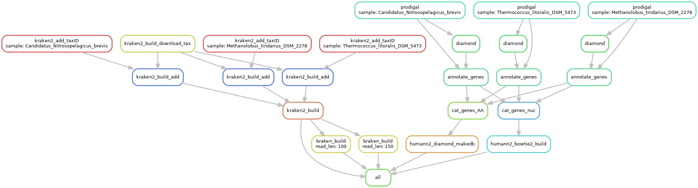

LLMGP-DB
========

Ley Lab MetaGenome Profiler DataBase generator

* Version: 0.1.2
* Authors:
  * Nick Youngblut <nyoungb2@gmail.com>
  * Jacobo de la Cuesta <jacobo.delacuesta@tuebingen.mpg.de>
* Maintainers:
  * Nick Youngblut <nyoungb2@gmail.com>
  * Jacobo de la Cuesta <jacobo.delacuesta@tuebingen.mpg.de>

# Description

## Getting database genomes

### conda env setup

* r-argparse
* r-curl
* r-data.table
* r-dplyr
* ncbi-genome-download

### Downloading genomes

* If using [GTDB](https://gtdb.ecogenomic.org/) genomes, run `GTDB_metadata_filter.R` to select genomes
* If downloading genomes from genbank/refseq, you can use `genome_download.R`

## Input data (`samples.txt` file)

* The pipeline requires a tab-delimited table that includes the following columns:
  * Sample ID
    * This will usually just be the species/strain names
  * Path to the genome assembly fasta file
    * NOTE: these must be gzip'ed
  * taxonomy ID
    * This should be the NCBI taxonomy ID at the species/strain level
      * Needed for Kraken
  * taxonomy
    * This should at least include `g__<genus>;s__<species>`
    * The taxonomy can include higher levels, as long as levels 6 & 7 are genus and species
    * Any taxonomy lacking genus and/or species levels will be labeled:
      * `g__unclassified`  (if no genus)
      * `s__unclassified`  (if no species)
    * This is needed for humann2
    
## Running the pipeline

For general instuctions on setting up and running the Ley Lab pipelines, see the [ll_pipeline_docs](https://gitlab.tuebingen.mpg.de/leylabmpi/pipelines/ll_pipeline_docs)

### Adding more samples to an existing custom DB

**tl;dr**

Make sure to use the `--notemp` flag. Just add more genomes to the input table and re-run in the pipeline.

**Full description**

Snakemake allows for easy re-running of the pipeline on just genomes that have not yet been processed.
You can just add more genomes to the input table and re-run the pipeline (test first with `--dryrun`).
Snakemake should just process the new genomes and then re-create the combined dataset files (this must be done each time).

## Using the resulting databases

* Set the paths to the new, custom databases in the `config_custom-db.yaml` file in the `LLMGP` pipeline.

# Pipeline overview

Example run on 2 metagenomes. 

