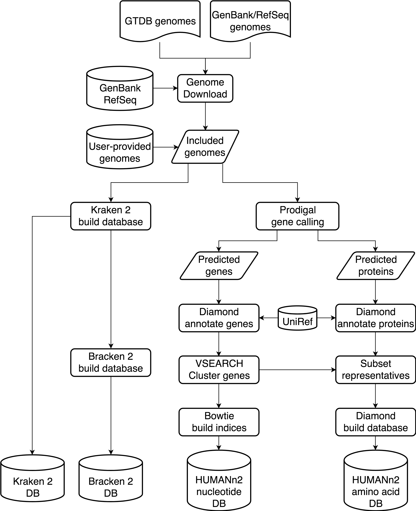

Struo
=====

**Struo:** a pipeline for building custom databases for common metagenome profilers

> "Struo" --> from the Latin: “I build” or “I gather”


* Version: 0.1.5
* Authors:
  * Nick Youngblut <nyoungb2@gmail.com>
  * Jacobo de la Cuesta <jacobo.delacuesta@tuebingen.mpg.de>
* Maintainers:
  * Nick Youngblut <nyoungb2@gmail.com>
  * Jacobo de la Cuesta <jacobo.delacuesta@tuebingen.mpg.de>
* Previous name
  * Ley Lab MetaGenome Profiler DataBase generator (LLMGP-DB)


# Citation

de la Cuesta-Zuluaga, Jacobo, Ruth E. Ley, and Nicholas D. Youngblut. 2019.
“Struo: A Pipeline for Building Custom Databases for Common Metagenome Profilers.”
bioRxiv. https://doi.org/10.1101/774372


# Pre-built custom databases

Custom GTDB databases available at the [struo data ftp server](http://ftp.tue.mpg.de/ebio/projects/struo/)

GTDB releases available:
  * Release 86  (14.03.2019)

GTDB releases in progress
  * Release 89 (30.08.2019)

# Tutorial

For a step-by-step example of how to prepare and execute Struo, see the notebook in the `./tutorial/` folder

# Description

## Struo’s workflow


Struo's work ow encompasses the steps from genome download to database construction

## Setup

### Download

To download the pipeline, clone the Git repository:

```
git clone git@github.com:leylabmpi/Struo.git 
```

### conda env setup

* python 3.6
* snakemake 5.7.0
* r-base 3.6
* r-argparse 2.0.1
* r-curl 4.2
* r-data.table 1.12.4
* r-dplyr 0.8.3
* ncbi-genome-download 0.2.10

### UniRef diamond database(s)

You will need a UniRef diamond database for the humann2 database construction (e.g., UniRef90).
See the "Download a translated search database" section of the
[humann2 docs](https://bitbucket.org/biobakery/humann2/wiki/Home#markdown-header-5-download-the-databases).

## Getting reference genomes for the custom databases

### Downloading genomes

* If using [GTDB](https://gtdb.ecogenomic.org/) genomes, run `GTDB_metadata_filter.R` to select genomes
* If downloading genomes from genbank/refseq, you can use `genome_download.R`

Example:

```
# Filtering GTDB metadata to certain genomes
./GTDB_metadata_filter.R -o gtdb-r89_bac-arc.tsv https://data.ace.uq.edu.au/public/gtdb/data/releases/release89/89.0/bac120_metadata_r89.tsv https://data.ace.uq.edu.au/public/gtdb/data/releases/release89/89.0/ar122_metadata_r89.tsv

# Downloading all genomes (& creating tab-delim table of genome info)
./genome_download.R -o genomes -p 8 gtdb-r89_bac-arc.tsv > genomes.txt

# Note: the output of ./genome_download.R can be directly used for running the `Struo` pipeline (see below)
```

### User-provided databases

Users can also provide genomes as compressed fasta files (`.fna.gz`). This also requires adding the corresponding information to the `samples.txt` file (see below)

## Input data (`samples.txt` file)

The table of input files/data can be created using the helper scripts described above. 

* The pipeline requires a tab-delimited table that includes the following columns (column names specified in the `config.yaml` file):
  * Sample ID
    * This will usually just be the species/strain names
  * Path to the genome assembly fasta file
    * NOTE: these must be gzip'ed
  * taxonomy ID
    * This should be the NCBI taxonomy ID at the species/strain level
      * Needed for Kraken
  * taxonomy
    * This should at least include `g__<genus>;s__<species>`
    * The taxonomy can include higher levels, as long as levels 6 & 7 are genus and species
    * Any taxonomy lacking genus and/or species levels will be labeled:
      * `g__unclassified`  (if no genus)
      * `s__unclassified`  (if no species)
    * This is needed for humann2

Other columns in the file will be ignored. The path to the samples file should be specified in the `config.yaml` file (see below)
    
## Running the pipeline

### Edit the `config.yaml`

* Specify the input/output paths
* Modify parameters as needed
* Add the path to the UniRef diamond database for HUMANn2 (see above for instructions on retrieving this file)

### Running locally

`snakemake --use-conda`

### Running on a cluster

If SGE, then you can use the `snakemake_sge.sh` script. You can create a similar bash script
for other cluster architectures. See the following resources for help:

* [Snakemake docs on cluster config](https://snakemake.readthedocs.io/en/stable/snakefiles/configuration.html)
* [Snakemake profiles](https://github.com/Snakemake-Profiles)

### General info on using `snakemake`

Snakemake allows for easy re-running of the pipeline on just genomes that have not yet been processed.
You can just add more genomes to the input table and re-run the pipeline (test first with `--dryrun`).
Snakemake should just process the new genomes and then re-create the combined dataset files (this must be done each time).
Make sure to not mess with the files in the `nuc_filtered` and `prot_filtered` directories! Otherwise,
snakemake may try to run all genomes again through the computationally expensive gene annotation process.


## Using the resulting databases

Set the database paths in humann2, kraken2, etc. to the new, custom database files.

* humann2
  * nucleotide
    * `all_genes_annot.fna.gz`
  * amino acid
    * `all_genes.dmnd`
* kraken2
  * `database*mers.kraken`
  

### Adding more samples (genomes) to an existing custom DB

Add new genomes to the input table and delete the following files (if they exist):

* humann2 database
  * all_genes_annot.dmnd
* kraken database
  * hash.k2d
  * taxo.k2d
* bracken database
  * database100mers.kraken
  * database150mers.kraken

### Adding existing gene sequences to humann2 databases

If you have gene sequences already formatted for creating a humann2 custom DB,
and you'd like to include them with the gene sequences generated from the
input genomes, then just provide the file paths to the nuc/prot fasta files
(`humann2_nuc_seqs` and `humann2_prot_seqs` in the `config.yaml` file).

All genes (from genomes & user-provided) will be clustered altogether with `vsearch`.
See the `config.yaml` for the default clustering parameters used.


